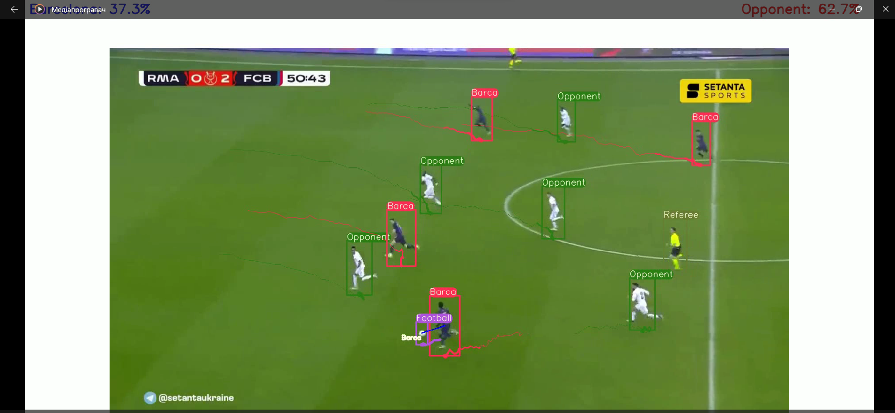
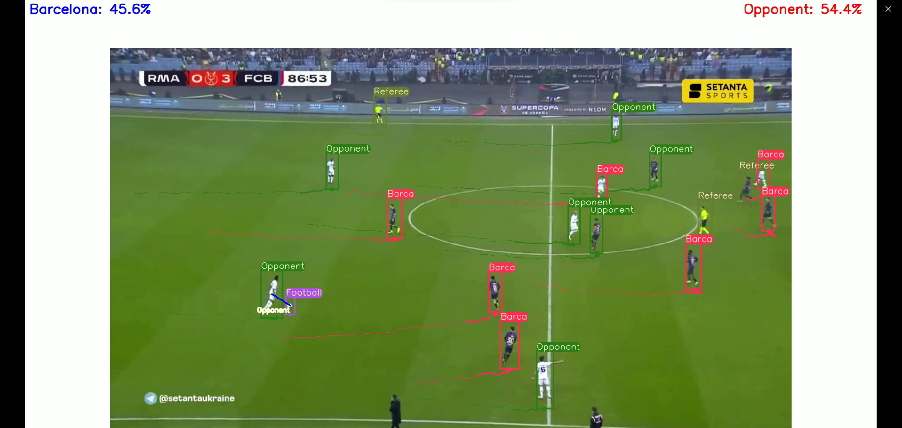

# Barcelona

## Team

- Inna Dragota
- Yurii Kharabara
- Oleh Bondar
- Vasyl Dorozhynskyi
- Yulia (TBD)
- Dmytro Omelian

<h1 align="center">Computer vision part
</h1>

<h3 align="center">Yurii Kharabara and Inna Dragota</h3>

<h1 align="center">Goal: detecting of ball possesion  in match Barcelona VS Real Madrid</h1>

[Video of match Barcelona VS Real Madrid](https://drive.google.com/file/d/1OCz-WSO76S3x9s67sVTQTRpX2Xsltl22/view?usp=drive_link) 
[Video detecting of players](https://drive.google.com/file/d/1ZBJ6kvKmYimA1k17NF7uc55jQCRYUfLH/view?usp=drive_link)

<h2>Our steps:</h2>

1. Downloading video from Youtube.
2. Labeling of players team Barcelona, opponents, referee and ball.
3. Export of dataset that divide on train, validation and test to project(using Roboflow).
4. Train of model Yolov7 on our dataset(defining of weights and performance graph, confusion matrix).
5. Defining of ball's probable flight path:  
   a) attempt to detection of ball; 
   b) if it don't detect, we use information about direction and speed for understanding of probable trajectory. We think that it's right way of flying (1 second); 
   с) if it don't detect during 1 second, we define it from previous frame.
6. Ball possession calculation(top left corner and top right corner).

<h2>Problems of using Yolov7:</h2>

1. When we used model for detection: bounding box of ball was hide behind bounding box of players.
   We tried to solve it by retraining it on separate datasets. First dataset is referee, players of Barca, second - ball.

2. Ball is hide between legs of players - solving became yellow rectangle that detect direction of the ball,
   we used direction and speed. If ball was lost, we took it from previous frame. 

If you want to use our model you can add more pictures from defferent matches to your dataset)

## Impact of Unexpected Outcomes on Betting Strategy aka "Betting"

<h3 align="center">Vasyl Dorozhynskyi</h3>

Goals:

- detect how many Barcelona matches ended with “unexpected” results, i.e. result doesn’t match lowest betting odd.
- detect is there profitable long-run betting strategy(period - season), if user always bets against odds.
- detect correlation between number of “unexpected” results in season and profit/loss
  Input data: results of LaLiga in seasons 2014/2015 - 2020/2021 from [Football Database dataset](https://www.kaggle.com/datasets/technika148/football-database)

Implementation - [notebooks/unexpected_results.ipynb](notebooks/unexpected_results.ipynb)

At first we analyzed how many matches ended with “unexpected” results.

And we got 3 "better" and 73 "worse" matches.

After that we analyzed two strategies for betting on unexpected results

- Linear - betting the same amount every game in season
- Catch-up strategy - betting amount is calculated by formula:

S = X+Y/K-1

S - is the stake or the amount of the required bet.

X - is the amount of potential profit from the first bet, minus the stake.

Y - is the sum of all previous losses.

K - is the odds of the upcoming event.

This gives us the following result:
the linear betting strategy, as expected, resulted in losses in four out of seven seasons. In contrast, the catch-up strategy yielded profits in every season, with its least profitable season still outperforming the best season of the linear strategy by double. Interestingly, basing the betting strategy on 'unexpected' results did not correlate with overall profit. This is likely because profitability is more influenced by the sequence of 'unexpected' matches rather than their total count in a season.

## Some analytics

<h3 align="center">Dmytro Omelian</h3>

**_ Datasets _**

- Transfermarkt dataset (for game events, players, etc.);
- StatsBomb (transfers);

**_ Goals _**

- find the best players group (connections graph);
- analyse young academy (Barcelona B players);
- some other приколи;

**_ Player connections _**

Tried to identify strong connections between some players
Used Leuvian method for building communities.
Results show that players that have more common seasons and games are more likely to be part of the same community. Partitioning of 3 periods (Messi, Puyol, current one)

Potential use-case: analyse game lineups and potential performance

**_ Barcelona B -> Barcelona A _**

Steps:

1. get all players in Barca A transferred from Barca B (18 players)
2. check out some things
3. players contribution rate

**_ Minutes played and substitute strategies (Xavi) _**

**_ Miscellaneous _**

- referee stuff
- pass maps
- positional distribution of incoming academy players (covid?)
- player performance index

Implementation - [notebooks/transfrmarket_processing.ipynb](notebooks/transfrmarket_processing.ipynb)
